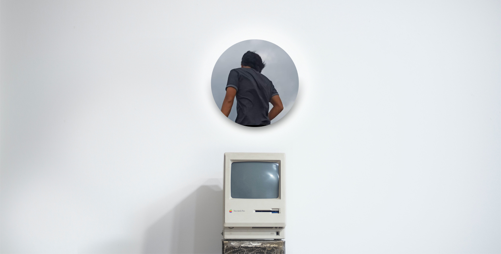

## <h2 align="center">Namaste 👋, I am Noel Xavier</h2>

### About Me

<!--START_SECTION:about-->

- 🎓 A recent graduate of BS Information Technology
- 🦉 A nocturnal sleepyhead Full-Stack Web Developer
- 👕 A vintage clothing curator. Check out my shop right [here](https://www.instagram.com/99th.chronicles/).
<!--END_SECTION:about-->

---

### Tech Stack: LAMP Stack and Flutter

<!--START_SECTION:stack-->

- 💻 Currently learning the LaraVue Stack
- 🔧 Dev tools and other stuffs include VS Code, Firefox Developer's Edition and Stack Overflow
<!--END_SECTION:stack-->

---

<h3>
Let's Connect 

</h3>
It would be great to start a community with you. Let's start an open source project together.

<!--START_SECTION:connect-->

- Country songs
- Vintage items and clothings
- Development and coding
<!--END_SECTION:connect-->

&nbsp;&nbsp;&nbsp;

---

### Oh wait, here's a meme for you. Have a nice day!

